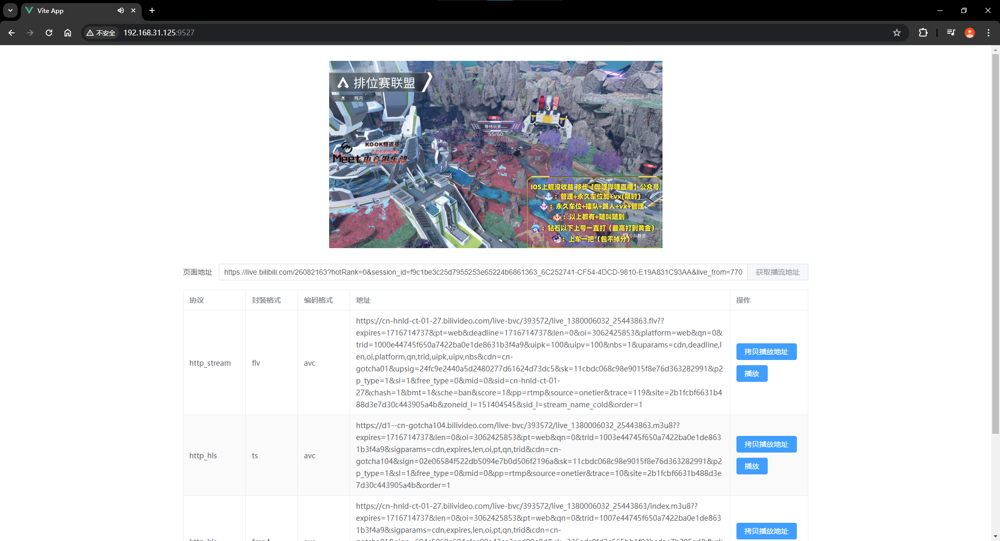

# 获取 b 站直播间的播流地址

现在墙内好多网站 app 都有登陆墙限制，不登陆就不给看，很蛋疼。比如 b 站不登陆账号某些直播间就看不了。

# 系统要求

ubuntu 20.04 以上

# 启动方式

```
./bilibili-livestream
```

打开 http://localhost:9527

# 使用方式

输入地址为直播页面的 url，比如<br>
https://live.bilibili.com/22383283?hotRank=0&session_id=7041ad02f3a4cb561aaf86bb0a477c2d_345EDB07-C14D-4F7F-B7FA-ADEBFAF9D3F5&live_from=77002&visit_id=41uvm6rfhay0<br>
然后就可以得到各种播流地址

# 截图


